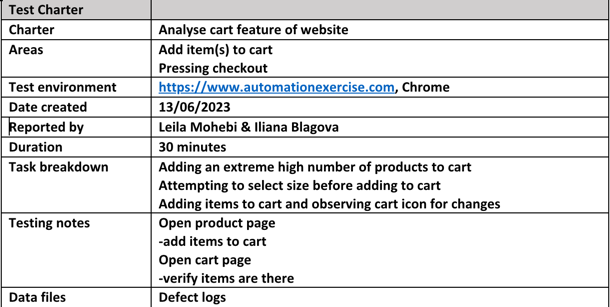
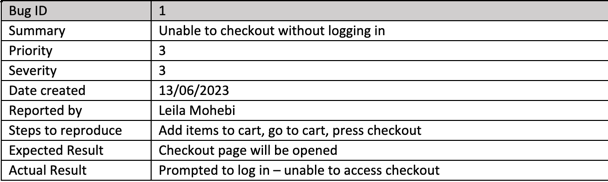
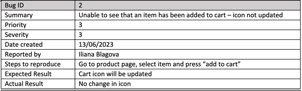
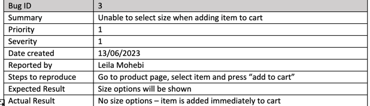
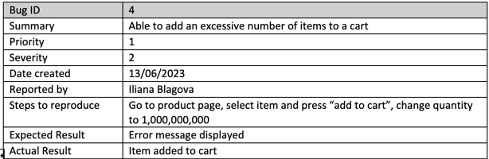
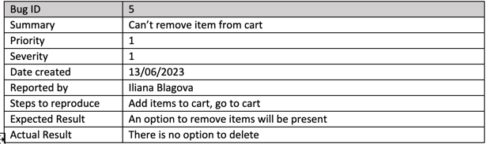
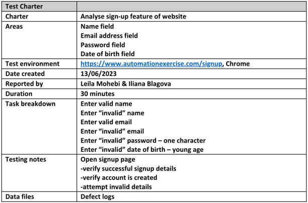
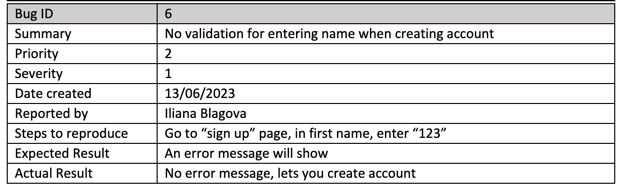
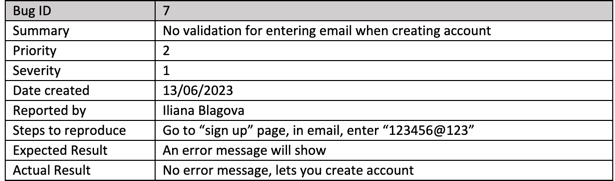
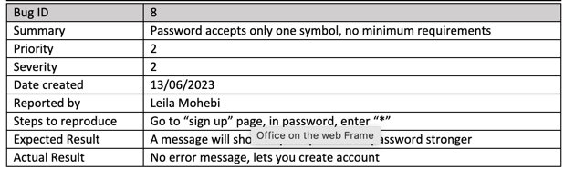

# Exploratory Testing Test Charters
Exploratory testing was carried out on the website to identify and locate any defects.
Two main areas were explored - the "cart" feature and the "sign-up" feature

## Charter 1: Analyse cart feature of the website

### Bugs found:
> 1. 
> 2. 
> 3. 
> 4. 
> 5. 
 
 

## Charter 2: Analyse sign-up feature of the website

> 1. 
> 2. 
> 3. 
> 4. 

