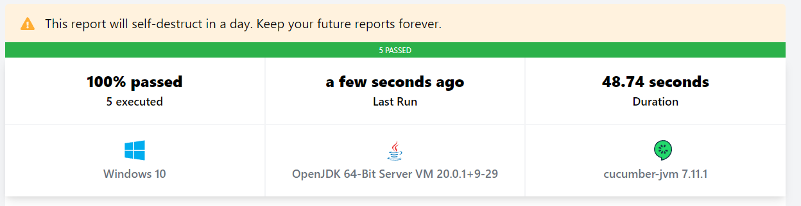
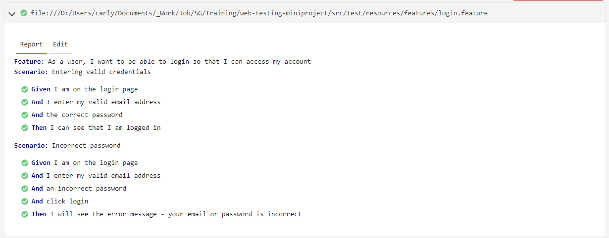
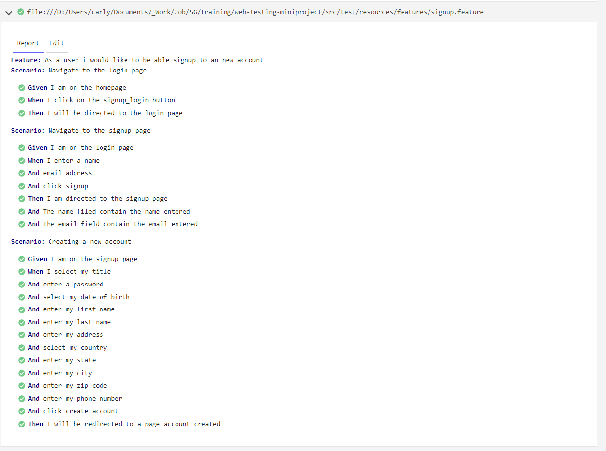

# Web Testing Mini Project
## Project Goal

- Write automated tests for Test Case 15 using Cucumber
  [Website Url](https://automationexercise.com/)
- Do exploratory testing on the following features:
  - adding products to cart
  - checking out
  - signing up
- Create a Test Charter
- Generate defect reports 

## How to set up your test framework

### Tools and technologies used:

>- [Java](https://www.java.com/en/) - programming language
>- [Maven](https://maven.apache.org/) - the build tool
>- [IntelliJ IDEA](https://www.jetbrains.com/idea/) - IDE
>- [Git](https://git-scm.com/) - version control
>- [Junit](https://junit.org/junit5/) - testing framework
>- [Hamcrest](https://hamcrest.org/) - framework for writing matcher objects
>- [Selenium WebDriver](https://www.selenium.dev/) - browser automation tool
>- [Cucumber](https://cucumber.io/) - used to automate test cases

### Steps to create a test automation framework:
>- Step 1: Create a GitHub repository
>- Step 2: Clone the git repo 
>- Step 3 Open the project in Intellij.    
>- Step 3: Add all dependencies and plugins to the pom.xml
>  - org.junit.jupiter
>  - org.hamcrest
>  - org.seleniumhq.selenium     
>  -- selenium-http-jdk-client  
>  -- selenium-java  
>    - io.cucumber   
>    -- cucumber-java  
>    -- cucumber-junit 
>  - Plugins  
>  --  Cucumber for java by JetBrains  
>  -- Gherkin by JetBrains 

## What was tested
###  **Automated Tests**

**User Story 1:**
As a user of the website, I want to be able to register for an account so that I can save my details and checkout

> - Scenario 1.1 : Navigate to the login page
> - Scenario 1.2 : Navigate to the signup page
> - Scenario 1.3: Creating a new account

**User Story 4:**
As a user, I want to be able to login so that I can access my account
> - Scenario 4.1: Entering valid credentials
> - Scenario 4.2: Incorrect password
> - Scenario 4.3: Invalid format email

###  **Exploratory Testing**
> **The primary objective of this exploratory testing session was to identify potential issues and verify the user experience related to:**
>
> - **Future Checkout:** Ensuring the functionality and usability of the feature which allows users to reserve products for future checkout.
> 
> - **Adding to Cart:** Checking the functionality of adding items to the shopping cart and verifying if they persist as users navigate through the site.
> 
> - **Signup:** Verifying the registration process for new users and ensuring the integrity and security of user data.

## Test Metrics
[Cucumber Report](https://reports.cucumber.io/reports/ac04cfe8-2009-4c3f-8c64-4f953da0a030)

### Collaborators
> - [Carlyn Humble](https://github.com/CarlynHumble)
> - [Leila Mohebi](https://github.com/leilamohebi)
> - [Iliana Blagova](https://github.com/iliana0724)
> - [Tessa George](https://github.com/tessthott)
> - [Maria Markou-Inglis](https://github.com/mariamar95)